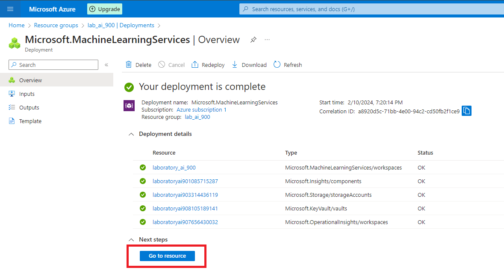

# Machine Learning in practice on Azule ML

Este repositório tem o propósito de armazenar o projeto desenvolvido no âmbito do módulo "Introdução ao Machine Learning" do Bootcamp "Microsoft Azure AI Fundamentals" da [DIO](https://www.dio.me/), sob a instrução da professora  [Valéria Baptista](https://www.linkedin.com/in/valeriabaptista/).

O projeto é requisito indispensável para a aprovação no módulo "Introdução ao Machine Learning", consolidando o aprendizado prático dos participantes e preparando-os para os desafios subsequentes.

O desenvolvimento deste projeto pretende demonstrar como é criar um modelo de Machine Learning no Microsoft Azure ML na prática. Para um melhor entendimentom, dividi em passos todo o processo, desde a criação do grupo de recursos ao resultado final da regressão.

# Machine Learning in practice on Azule ML

This repository has the purpose of storing the project developed within the scope of the "Introduction to Machine Learning" module of the "Microsoft Azure AI Fundamentals" Bootcamp by [DIO](https://www.dio.me/), under the instruction of the teacher [Valéria Baptista](https://www.linkedin.com/in/valeriabaptista/).

The project is an essential requirement for passing the "Introduction to Machine Learning" module, consolidating participants' practical learning and preparing them for subsequent challenges.

The development of this project aims to demonstrate what it is like to create a Machine Learning model in Microsoft Azure ML in practice. For a better understanding, i divided the entire process into steps, from creating the resource group to the final regression result.

## Step 1: Creating a Resource

First, let's create an Azure Machine Learning workspace. To do this, create a Resource and search for Azure Machine Learning.

  

## Step 2: Configurating a Azure Machine Learning Workspace 

In the basics tab, we will add our workspace information. Since we are in a learning lab, we will not configure other tabs. Para criar clicamos em "Review + Create" e depois "Create".

  

Após finalizar a criação do Workspace vamos para o Resource.

  

Em seguida, iniciaremos o Studio ML do Azure.

  

