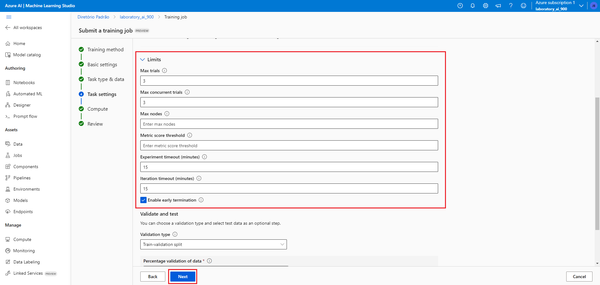
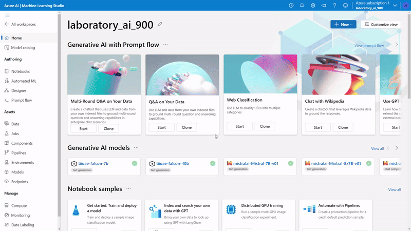

# Machine Learning in practice on Azule ML

This repository has the purpose of storing the project developed within the scope of the "Introduction to Machine Learning" module of the "Microsoft Azure AI Fundamentals" Bootcamp by [DIO](https://www.dio.me/), under the instruction of the teacher [Valéria Baptista](https://www.linkedin.com/in/valeriabaptista/).

The project is an essential requirement for passing the "Introduction to Machine Learning" module, consolidating participants practical learning and preparing them for subsequent challenges.

The development of this project aims to demonstrate what it is like to create a Machine Learning model in Microsoft Azure ML in practice. For a better understanding, i divided the entire process into steps, from creating the resource group to the final regression result.

## Step 1: Creating a Resource

First, let's create an Azure Machine Learning workspace. To do this, create a Resource and search for Azure Machine Learning.

  

## Step 2: Configurating a Azure Machine Learning Workspace 

In the basics tab, we will add our workspace information. Since we are in a learning lab, we will not configure other tabs. 

To create we click on "Review + Create" and then "Create".

  

After finishing the creation of the Workspace, we click "Go to the Resource".

  

Next, we'll launch Azure ML Studio.

  

## Step 3: Creating a new Machine Learning Job

On the Studio page we will start a new Machine Learning Job.

  

## Step 4: Configurating a Machine Learning Job

We select the automatic training method.

  

In basics settings we will fill in the name of the job and the name of the experiment.

  

In task type and data we select the Regression task type and select the data set.

  

We will inform the name and type of data.

  

Now, we will select the data source.

  

We enter the web url of the data source.

  

We need to configure our data. Under "Columm Headers", we will select "Only First File has headers". After that, we wait for the data to be validated and move on to the next step.

  

In Schema, we don't need to change any information.

  

Now, we review our data and create it. Once created, we select them and move on to the next configuration.

In task settings we select the "Rentals" column as the variable of interest. And in additional settings we will select "NormalizeRootMeanSquaredError" as a metric, uncheck all flags and the allowed models will be "RadomForest" and "LightGBM".

In "Validate and Test" we will select "Train-Validation Split" as Validation Type and the Percentual validation of data will be 10%. 

  

In "Limits" we will fill in the information as shown in the image.

  

When moving forward, in "Compute", i kept the values shown in the image below.

  

Then, we review the job and click next to train the Machine Learning model.

Next, we need to create the model.

  

## Step 5: Model Metrics

To access the metrics of the trained model, on the model page, click the link indicated under “Created by job.” Once on the task page, navigate to the metrics tab to view the results.

  

## Step 6: Model Test

Now we will configure the endpoints so that we can deploy our model.

  

After the deployment process is complete, we will test the model.

For testing, i used the file:

[test.json](test.json)

  

The forecast generated for our model was 361.80 bicycle rentals.

## Useful Links:

[Explore Azure AI Services](https://microsoftlearning.github.io/mslearn-ai-fundamentals/Instructions/Labs/02-content-safety.html)

[Explore Automated Machine Learning in Azure Machine Learning](https://microsoftlearning.github.io/mslearn-ai-fundamentals/Instructions/Labs/01-machine-learning.html)

[Data Source](https://raw.githubusercontent.com/MicrosoftLearning/mslearn-ai-fundamentals/main/data/ml/daily-bike-share.csv)

## Tecnologias Utilizadas

- Microsoft Azure Machine Learning

## Contributions

Contributions are welcome. Feel free to suggest improvements and possible corrections to the code.

## Author

Jadeson Bruno Albuquerque da Silva

